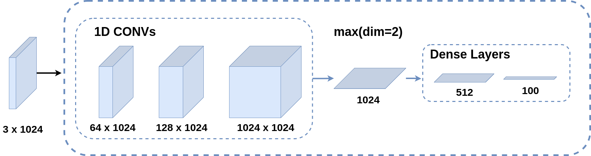
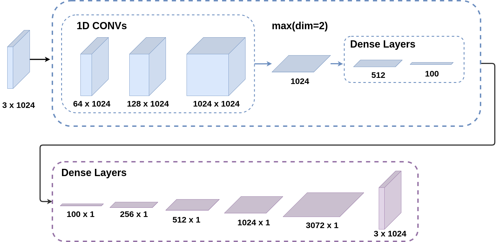
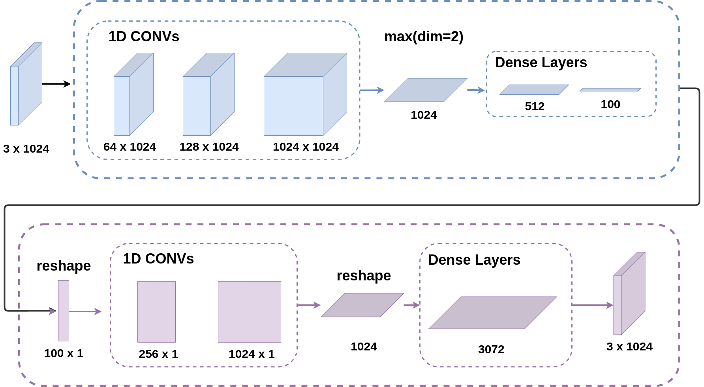
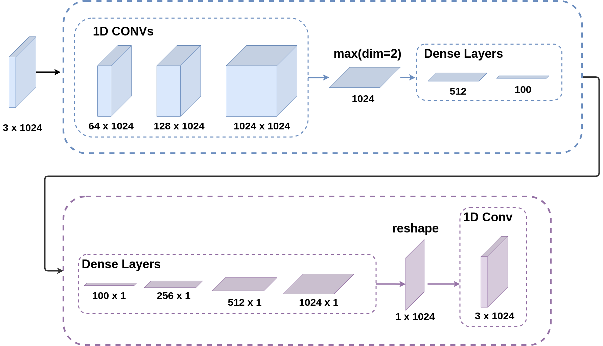
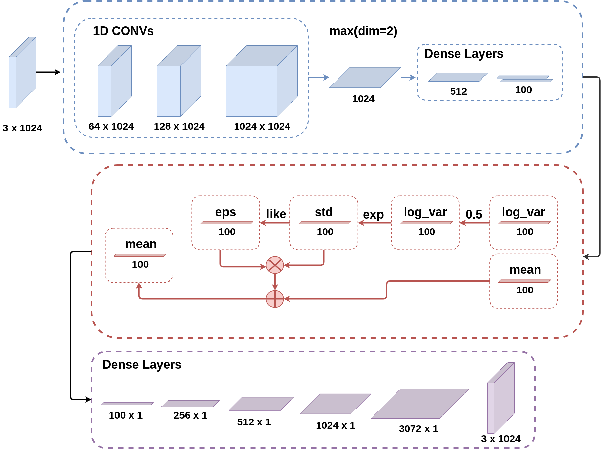

## PMLDL’21. Project Progress D1.5

## Student Information

**Student**: Anna Boronina

**Group**: BS18-DS-01

**Telegram:** @whoorma

**The topic: Autoencoder for Point Clouds**

## Navigation

First, I give a link to the original dataset and discuss three ways to augmentent the data. Two of these methods will be used further. Then I explain the architecture of the encoder part and three possible architectures of the decoder part with plots of training and validation process. All models (except the third one) were trained on two chosen data augmentations. I also include plots that show losses on one train batch and on one validation batch.

At the end I give my own interpretation of the results and possible ways to improve them.

## Pointcloud

A pointcloud is one of the ways to represent 3D data. It is a set of data points in space. Working with point clouds is considered efficient, so many NNs authors [1-5] choose this representation. A pointcloud can have any density which will definitely affect the efficiency of the network.

## Data Collection

For this project, I use [ShapeNet](http://3dvision.princeton.edu/projects/2014/3DShapeNets/) dataset created and maintained by Princeton University. Even though it contains 10 classes (there is a version with 40 classes), I use only one class: beds. This dataset consists of 3D objects in voxel representation. For my task, I transform them to pointclouds because this representation is more efficient to work with.

## Data Augmentation

While experimenting, I often changed the way I augment the data. Possible augmentations are:

1. `PointSampler(N)` - it samples N points from a given pointcloud
2. `ToSorted()` - it sorts a given pointcloud by X, Y, and Z sequentially
3. `Normalize()` - it normalizes a given pointcloud
4. `RandomNoise()` - it adds random noise to a normalized pointcloud
5. `RandomRotate()` - it rotates a given pointcloud by a random angle. PointNet authors used this augmentation to make their network view independent, but I do not use it.
6. `ToTensor()` - it transforms a given pointcloud to a tensor for further training.

### Dataloader 1: Static Data Augmentation

Static data augmentation means that it’s applied once before training. Therefore, the model sees the same samples over and over again, even though they are shuffled. The transformations applied are:

1. `PointSampler(1024)`
2. `ToSorted()`
3. `Normalize()`
4. `ToTensor()`

Hypothesis: lack of “on-the-fly” augmentation will lead to overfitting.

### Dataloader 2: Dynamic Data Augmentation

On the other hand, dynamic data augmentation means that all the transformations are applied during training. Therefore, the model sees completely different samples all the time, because even `PointSampler(1024)` chooses different points all the time.

The same transformations (as in the previous subsection) are applied during training.

This augmentation will not be considered in this project because training on so many different samples takes a lot of time and computational resources which I do not have.

### Dataloader 3: Static and Dynamic Data Augmentation

This approach combine two approaches discussed above: static (applied before training to the whole data) and dynamic (applied to each sample during training).

Static transformations:

1. `PointSampler(1024)`
2. `ToSorted()`
3. `Normalize()`

Dynamic transformations:

1. `RandomNoise()`
2. `ToTensor()`

This way, all the samples that model sees are very similar but slightly different - in theory, it’s enough difference to learn and not enough similarity to overfit.

Hypothesis: the number of epochs to train should be higher than for purely static augmentation, yet performance on the validation set should be higher.

## Autoencoder Architecture

### Inspiration

PointNet [1] architecture inspires many models that work with pointclouds. The main feature I’ve learned from them is to apply `Conv1d` to a pointcloud, which is not intuitive at all. I can apply it to either increase number of dimensions or to increase number of points. These two ideas will be tested below.

### Encoder

Encoder is a module consisting of two main parts: 1D convolutions and dense layers. The layer with 1D convolutions takes shape `[3x1024]` and treats `3` (number of dimensions) as a number of channels. By doing the convolutions, it increases number of “channels” from `3` to `1024`. After that we get shape `[1024, 1024]` and flatten it to `[1024]` (or just `[1024]`. Flattening happens by taking the max value over second dimension (it is, basically, max pooling with kernel 1024). Then 1024 neurons are fed into module with dense layers. Final output of the encoder is shape `[100]` - in other words, just 100 neurons which is so-called latent space.



```python
PointEncoder(
  (convs): Sequential(
    (0): Conv1d(3, 64, kernel_size=(1,), stride=(1,))
    (1): BatchNorm1d(64, eps=1e-05, momentum=0.1, affine=True, track_running_stats=True)
    (2): ReLU()
    (3): Conv1d(64, 128, kernel_size=(1,), stride=(1,))
    (4): BatchNorm1d(128, eps=1e-05, momentum=0.1, affine=True, track_running_stats=True)
    (5): ReLU()
    (6): Conv1d(128, 1024, kernel_size=(1,), stride=(1,))
    (7): BatchNorm1d(1024, eps=1e-05, momentum=0.1, affine=True, track_running_stats=True)
  )
  (dense): Sequential(
    (0): Linear(in_features=1024, out_features=512, bias=True)
    (1): ReLU()
    (2): Linear(in_features=512, out_features=100, bias=True)
  )
)
```

### Decoder Type 1

The first time of decoder is a purely linear one. It takes the output of the encoder (which has shape `[100]`) and increases its size iteratively to have shape `[3072]`. It is later converted into `[3x1024] ` where 3 is the number of dimensions and 1024 is  a number of points.



```python
PointDecoderOriginal(
  (dense_layers): Sequential(
    (0): Linear(in_features=100, out_features=128, bias=True)
    (1): ReLU()
    (2): Linear(in_features=128, out_features=256, bias=True)
    (3): ReLU()
    (4): Linear(in_features=256, out_features=512, bias=True)
    (5): ReLU()
    (6): Linear(in_features=512, out_features=1024, bias=True)
    (7): Linear(in_features=1024, out_features=3072, bias=True)
    (8): Tanh()
  )
)
```

#### Trained on dataloader 1

Results of training. Below one can find two plots: training loss and validation loss during training. It is obvious that the model overfitted on the training data. Validation loss has been rapidly increasing. Below you will find some example of model’s performance. 

<div style="display: flex; align-items: center; justify-content: center; flex-direction: column;">


</div>
**Left**: chamfer loss for a train batch; **Right**: chamfer loss for a validation batch;


##### TRAIN

loss: 4.3

<div style="display: flex; align-items: center; justify-content: center;">


</div>

##### VALID

loss: 91.62

<div style="display: flex; align-items: center; justify-content: center;">


</div>

loss: 80.08

<div style="display: flex; align-items: center; justify-content: center;">


</div>

#### Trained on dataloader 3

This time validation loss started lowering after a while but still got stuck at around 110. The results for both train and valid datasets are not astonishing, which correlates with learning on noisy data. Nevertheless, it's visible that the model has learned some global features: hight of the bed, on what it stands, flatness, etc. The main improvement is that validation loss is lower than in the previous trial with dataloader 1 which has only static augmentation.

<div style="display: flex; align-items: center; justify-content: center; flex-direction: column;">


</div>

**Left**: chamfer loss for a train batch; **Right**: chamfer loss for a validation batch;


##### TRAIN

loss: 0.8769

<div style="display: flex; align-items: center; justify-content: center;">


</div>

loss: 48.64

<div style="display: flex; align-items: center; justify-content: center;">


</div>
<div style="display: flex; align-items: center; justify-content: center;">


</div>

##### VALID

loss: 83.9

<div style="display: flex; align-items: center; justify-content: center;">


</div>

loss: 128

<div style="display: flex; align-items: center; justify-content: center;">


</div>

loss: 84.3

<div style="display: flex; align-items: center; justify-content: center;">


</div>

#### Compare results of Decoder Type 1 on two data augmentations

Below there is some statistics.

##### Training and validation losses

**My conclusion**: This model (with purely dense decoder) overfits on dataloader without dynamic augmentation. It overfits *less* on dataloader with dynamic augmentation.

**Blue**: static data augmentation. **Orange**: static and dynamic data augmentation.

**First**: training process; **Second**: validation process:

<div style="display: flex; align-items: center; justify-content: center; flex-direction: column;">


</div>

###### Model trained on dataloader type 1.

**My conclusion**: validation losses plots based on one batch (48 samples) have spikes at around the same points. Validation data was not shuffled, so I can conclude that no matter what the model was trained on, it will perform worse on 13th or 48th pointclouds and better on 10th or 34rd pointclouds.

**Left**: chamfer loss for a train batch; **Right**: chamfer loss for a validation batch;


###### Model trained on dataloader type 3.

**Left**: chamfer loss for a train batch; **Right**: chamfer loss for a validation batch;


### Decoder Type 2

The second experimental type of decoder is not as simple as the first one. It takes shape `[100]` and turns it into shape `[100, 1]`, so now 100 is number of channels and it’s fed into convolution layers. After that, we have shape `[1024, 1]`. Since we need to increase it by 3, be turn it into 1024 neurons, extend it to 3072 neurons and reshape into `[3x1024]`. 



```python
PointDecoderPoints(
  (conv_layers): Sequential(
    (0): Conv1d(100, 256, kernel_size=(1,), stride=(1,))
    (1): BatchNorm1d(256, eps=1e-05, momentum=0.1, affine=True, track_running_stats=True)
    (2): ReLU()
    (3): Conv1d(256, 1024, kernel_size=(1,), stride=(1,))
    (4): BatchNorm1d(1024, eps=1e-05, momentum=0.1, affine=True, track_running_stats=True)
    (5): ReLU()
  )
  (linear): Sequential(
    (0): Linear(in_features=1024, out_features=3072, bias=True)
    (1): Dropout(p=0.05, inplace=False)
    (2): Tanh()
  )
)
```

#### Trained on dataloader 1

Results of training. Below one can find two plots: training process and validation process during training. It is obvious that the model overfitted on the training data. 

<div style="display: flex; align-items: center; justify-content: center; flex-direction: column;">


</div>

**Left**: chamfer loss for a train batch; **Right**: chamfer loss for a validation batch;


##### TRAIN

loss: 4.5

<div style="display: flex; align-items: center; justify-content: center;">


</div>

loss: 63.38

<div style="display: flex; align-items: center; justify-content: center;">


</div>

loss: 2.36

<div style="display: flex; align-items: center; justify-content: center;">


</div>

##### VALID

loss: 171.67

<div style="display: flex; align-items: center; justify-content: center;">


</div>

loss: 120.3

<div style="display: flex; align-items: center; justify-content: center;">


</div>
#### Trained on dataloader 3

<div style="display: flex; align-items: center; justify-content: center; flex-direction: column;">


</div>

**Left**: chamfer loss for a train batch; **Right**: chamfer loss for a validation batch;


##### TRAIN

loss: 41

<div style="display: flex; align-items: center; justify-content: center;">


</div>


loss: 3.1

<div style="display: flex; align-items: center; justify-content: center;">


</div>

loss: 52.4

<div style="display: flex; align-items: center; justify-content: center;">


</div>

loss: 4.42

<div style="display: flex; align-items: center; justify-content: center;">


</div>

##### VALID

loss: 130.2

<div style="display: flex; align-items: center; justify-content: center;">


</div>

loss: 128.6

<div style="display: flex; align-items: center; justify-content: center;">


</div>

#### Comparing Decoder Type 2 on two augmentations

**My conclusion**: This model showed very similar results on both types of dataloaders. It managed to decrease validation loss after it increased at the beginning - by this metric, this model is better than Autoencoder with decoder type 1.

<div style="display: flex; align-items: center; justify-content: center; flex-direction: column;">


</div>

###### Model trained on dataloader type 1.

**Left**: chamfer loss for a train batch; **Right**: chamfer loss for a validation batch;


###### Model trained on dataloader type 3.

**Left**: chamfer loss for a train batch; **Right**: chamfer loss for a validation batch;


### Decoder Type 3

This architecture is very similar to decoder type 2. The only difference is that now in this one I use `Conv1d` to increase number of points instead of number of channels. For an unknown reason, it gives a straight line no matter what is the input.



```python
PointDecoderChannels(
  (dense_layers): Sequential(
    (0): Linear(in_features=100, out_features=256, bias=True)
    (1): Dropout(p=0.05, inplace=False)
    (2): ReLU()
    (3): Linear(in_features=256, out_features=512, bias=True)
    (4): Dropout(p=0.05, inplace=False)
    (5): ReLU()
    (6): Linear(in_features=512, out_features=1024, bias=True)
    (7): ReLU()
  )
  (conv): Sequential(
    (0): Conv1d(1, 3, kernel_size=(1,), stride=(1,))
    (1): BatchNorm1d(3, eps=1e-05, momentum=0.1, affine=True, track_running_stats=True)
    (2): Tanh()
  )
)
```

<div style="display: flex; align-items: center; justify-content: center;">

</div>


## Summary of the results

These plots below are repeated.

Linear Decoder. **Blue**: static data augmentation. **Orange**: static and dynamic data augmentation.

<div style="display: flex; align-items: center; justify-content: center;">


</div>

Decoder with `Conv1d`. **Blue**: static data augmentation. **Orange**: static and dynamic data augmentation.

<div style="display: flex; align-items: center; justify-content: center;">


</div>

### Interpretation of the results

Even though authors of neural networks such as PointNet [1] and DeepSet [5] say that there is no need to order points because MLP can learn representations on its own. Nevertheless, my attempt to do that failed - model with dense layers was more likely to overfit because there are no drop out layers - when I used them, the network could not learn at all.

It is noticeable that validation loss is increasing during training and in some cases it decreases after first half of training process. It starts at around 100 because the model’s output is mostly noise for those samples it has never seen before. If we look at Linear Decoder, we can see that the validation loss is increasing, yet validation loss is more or less stable for data with dynamic augmentation. Since we also saw the results when linear decoder could reproduce 

## Main notes

#### Activation Functions

Activations that I use in the architecture are ReLU for intermediate layers and Tanh for the last layer.

#### Batch Size

Batch size is 48. There is no proper reason to use it, during the experiments I noticed that with batch size of 16 the model is learning slower than with batch size of 32. Then I decided to increase it to 48 and got even better results than with 32. Unfortunately, it has not been documented.

#### Optimizer and Early Stopping

1. Optimizer is AdamW with learning rate 0.0009 and momentum (0.8, 0.8).

2. Learning rate scheduler decreased learning rate by 0.5 every 1000 epochs.

3. I used manual early stopping Weights Initialization: Xavier. The inspiration for it is taken from this [article](https://github.com/loliverhennigh/Variational-autoencoder-tricks-and-tips/blob/master/README.md). I didn’t notice much difference, probably because my model generally doesn’t perform well no matter with or without this activation.

#### Loss Function

For working with point clouds, I use **Chamfer distance (CD)**  as a loss function. The idea of CD is to compute the length of a shortest path on the grid. Let $U$ and $V$ be two pointclouds. We measure the shortest distance between $u \in U$ and the closest point to it from $V$, then we do the same for each point in $U$ and calculate the sum:

$$
CD(U, V) = \Sigma_{v \in V}||v - u||_2^2 + \Sigma_{u \in U}||u - v||_2^2
$$

The implementation of this function can be found in [`pytorch3d.loss.chamfer`](https://pytorch3d.readthedocs.io/en/latest/_modules/pytorch3d/loss/chamfer.html).

## Future Work

### Graph Neural Network

Graph Neural Networks can be helpful for working with pointclouds because they could capture connections between different points. There were attempts to do that, one of them is PointGNN architecture [2].

### Longer training time

One of my hypothese is that if those models that showd validation loss decreasing are trained for longer, they can show better results on validation set. For example, the second model (when was trained on dataloader with adding noise dynamically) showed that while training loss was stuck, validation loss was decreasing.

### Variational Autoencoder

Possible architecture for Variational AutoEncoder is presented below. Unfortunately, it was not tested due to bad perfomance of _just_ autoencoder. Decoder part can be substituted with any other one, of course.



## Links

[GitHub repository](https://github.com/annwhoorma/pmldl-project)

## References

[1] C. R. Qi, H. Su, K. Mo, en L. J. Guibas, “PointNet: Deep Learning on Point Sets for 3D Classification and Segmentation”, *arXiv [cs.CV]*. 2017.

[2] W. Shi en R. Rajkumar, “Point-GNN: Graph Neural Network for 3D Object Detection in a Point Cloud”, in *Proceedings of the IEEE/CVF Conference on Computer Vision and Pattern Recognition (CVPR)*, 2020.

[3] C. R. Qi, L. Yi, H. Su, en L. J. Guibas, “PointNet++: Deep Hierarchical Feature Learning on Point Sets in a Metric Space”, *CoRR*, vol abs/1706.02413, 2017.

[4] Z. Liu, H. Tang, Y. Lin, en S. Han, “Point-Voxel CNN for Efficient 3D Deep Learning”, *arXiv [cs.CV]*. 2019.

[5] M. Zaheer, S. Kottur, S. Ravanbakhsh, B. Póczos, R. Salakhutdinov, en A. J. Smola, “Deep Sets”, *CoRR*, vol abs/1703.06114, 2017.
